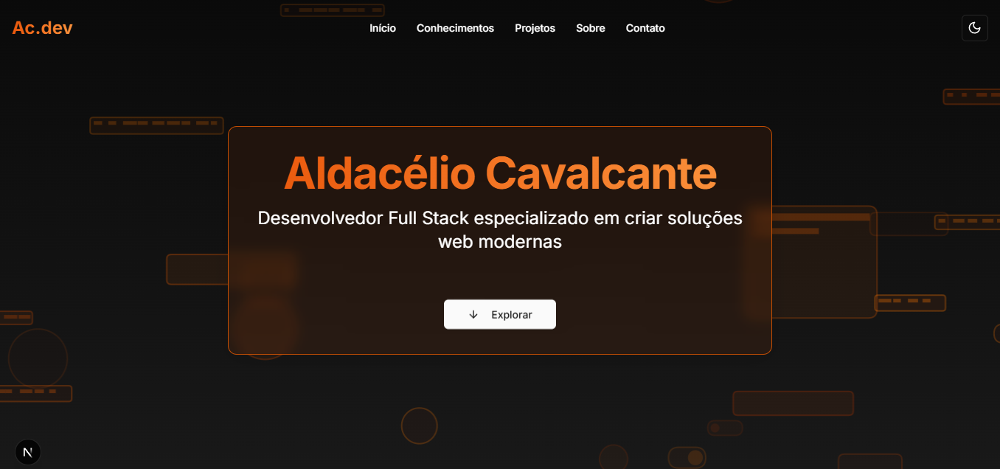

# 🚀 Meu Portfólio

<p align="center">
  
</p>

## 💻 Projeto

Este é meu portfólio pessoal, desenvolvido com tecnologias modernas para apresentar meus projetos e habilidades como desenvolvedor. O site conta com design responsivo, animações suaves e modo dark/light. [Veja aqui meu portfólio](https://meu-portfolio-flax-zeta.vercel.app/)

## ✨ Tecnologias

- [Next.js 15](https://nextjs.org/)
- [React 19](https://reactjs.org)
- [TypeScript](https://www.typescriptlang.org/)
- [Tailwind CSS](https://tailwindcss.com/)
- [Framer Motion](https://www.framer.com/motion/)
- [Radix UI](https://www.radix-ui.com/)
- [EmailJS](https://www.emailjs.com/)

## 🔍 Features

- ⚡ Performance otimizada com Next.js
- 🎨 Design responsivo e moderno
- 🌓 Tema claro/escuro
- 💨 Animações suaves com Framer Motion
- 📧 Formulário de contato funcional
- 🎯 Seções de Projetos, Habilidades e Sobre
- 📱 Interface adaptativa para todos dispositivos

## 🚀 Como executar

```bash
# Clone este repositório
$ git clone https://github.com/Aldacelio/meu-portfolio

# Entre na pasta do projeto
$ cd meu-portfolio/frontend

# Instale as dependências
$ npm install

# Execute a aplicação
$ npm run dev

# O site estará disponível em http://localhost:3000
```

## 🎨 Layout

O layout foi desenvolvido pensando em uma experiência de usuário moderna e profissional, com foco em:

- Navegação intuitiva
- Apresentação clara dos projetos
- Seções bem organizadas
- Experiência visual agradável

---

Feito por Aldacélio 👋 [Entre em contato!](https://www.linkedin.com/in/antonio-aldacélio-a42a1212b/)
